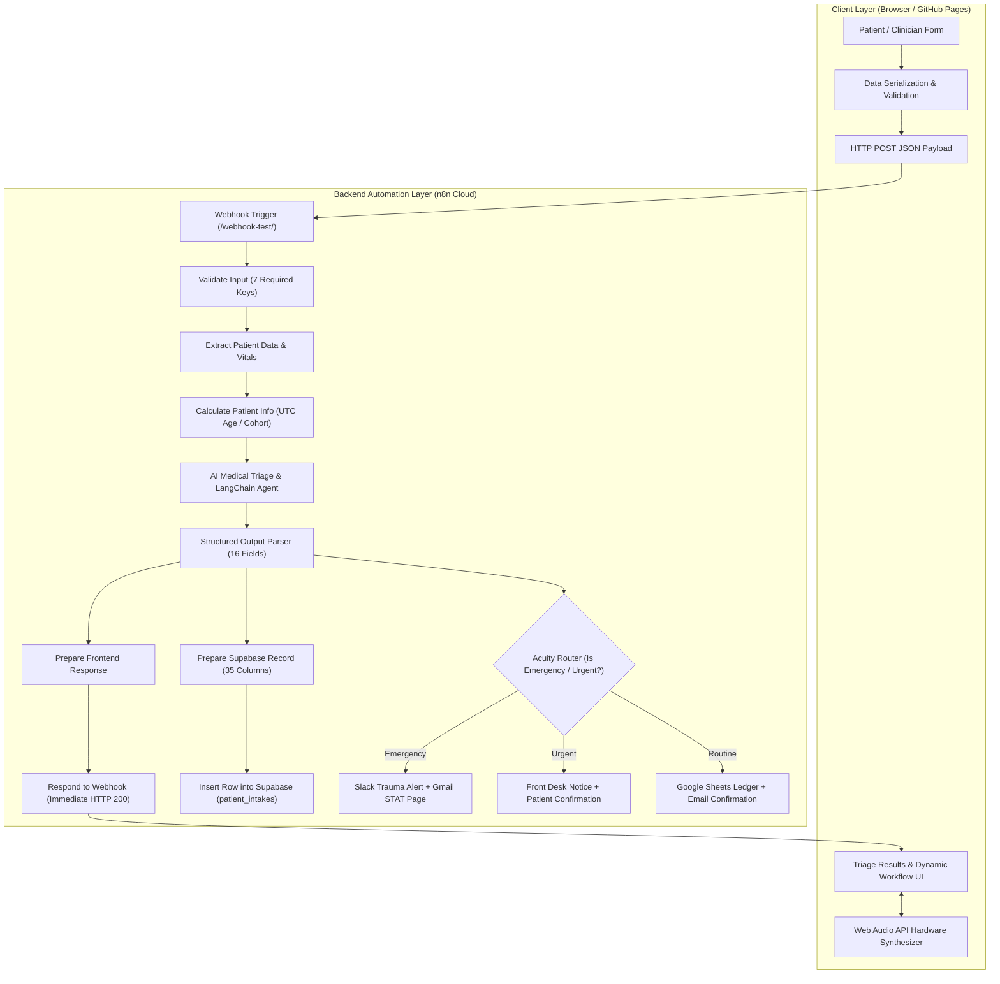

# 🏥 MediClin

## AI Medical Intake & Smart Triage Workstation

> **MediClin** is an enterprise-grade, browser-based **AI Medical Intake & Smart Triage Workstation** engineered for emergency departments, urgent care clinics, and ambulatory outpatient centers. It transforms patient telemetry, vital signs, and clinical symptoms into structured **Emergency Severity Index (ESI Levels 1–5)** acuity scores, dynamic automation pathways (**Emergency**, **Urgent**, and **Routine**), and standardized **SBAR Physician Handoff Briefs** via bi-directional **n8n Cloud** orchestration and secure backend persistence.

---

### 🌐 Live Production Deployment

[](https://sujalzz88.github.io/MEDICLIN-/)

**Deployed Application URL**: [`https://sujalzz88.github.io/MEDICLIN-/`](https://sujalzz88.github.io/MEDICLIN-/)  
**Active n8n Gateway**: `https://aryanna.app.n8n.cloud/webhook-test/a5b3b9e3-267f-406f-a37b-aabeff9b50d0`

---

### 🛡️ Verified Technology Badges


-EA4B71?style=flat-square&logo=n8n&logoColor=white)


---

## 🧭 Quick Navigation

| Section | Description |
| :--- | :--- |
| [🧠 Overview](#-system-overview) | What MediClin is and core clinical capabilities |
| [🎯 Problem vs. Solution](#-problem-vs-solution) | Bottlenecks in triage and how MediClin solves them |
| [⚙️ System Architecture](#️-system-architecture) | End-to-end data pipeline from DOM to n8n and Supabase |
| [🤖 AI Triage & Clinical Decision Support](#-ai-triage--clinical-decision-support) | ESI 5-level scoring, red-flag detection, and differential analysis |
| [🚨 Dynamic Automation Pathways](#-dynamic-automation-pathways) | Emergency, Urgent, and Routine workflow visualizations |
| [📋 SBAR Physician Handoff Matrix](#-sbar-physician-handoff-matrix) | Standardized Situation, Background, Assessment, and Recommendation brief |
| [📅 Universal Routine & Care Planner](#-universal-routine--care-planning-workspace) | Reusable operational scheduling workspace |
| [🔊 Web Audio Telemetry Synthesizer](#-web-audio-api-hardware-synthesizer) | Procedural hospital acoustic sirens, triads, and chimes |
| [🎨 Neumorphic Design System](#-neumorphic-uiux-design-system) | Soft-UI tokens, WCAG AAA contrast, and responsive layout |
| [🔒 Security & PHI Isolation](#-security-hipaa-readiness--credential-isolation) | Zero frontend credentials and vault-encrypted access |
| [🚀 Local Setup & Verification](#-local-setup--getting-started) | How to run and test MediClin locally |
| [⚠️ Medical Disclaimer](#-medical-disclaimer) | Clinical decision support boundary statement |

---

## 🧠 System Overview

Traditional patient intake treats high-acuity, life-threatening cases identically to routine outpatient visits on static clipboards and forms. **MediClin** bridges the critical gap between patient submission and emergency room intervention by executing instantaneous, structured AI clinical evaluation, triggering automated hospital notifications, persisting medical records in a secure database, and rendering an interactive, tactile workstation dashboard for medical staff.

```
┌──────────────────────────────────────────────────────────────────────────────────────────────────┐
│                                   CLINICAL HEADER BAR                                            │
│  [✚ MediClin Emblem]       [Live Clock: 14:15:02]       [🔊 Audio]       [● INTAKE ACTIVE]        │
├─────────────────────────┬────────────────────────────────────────────────────────────────────────┤
│     SIDEBAR DRAWER      │                           MAIN WORKSPACE CANVAS                        │
│                         │ ┌────────────────────────────────────────────────────────────────────┐ │
│ 📊 HOME CONSOLE         │ │ STEP 1: PATIENT INTAKE ➔ STEP 2: AI TRIAGE ➔ STEP 3: PROVIDER BRIEF│ │
│ 🚨 EMERGENCY QUEUE (1)  │ └────────────────────────────────────────────────────────────────────┘ │
│ ⚠️ URGENT QUEUE (0)     │ ┌────────────────────────────────────────────────────────────────────┐ │
│ 📅 ROUTINE PLANNING     │ │ ROW 1: 14-FIELD PATIENT INTAKE & VITAL TELEMETRY FORM              │ │
│ ℹ️ ABOUT ENGINE         │ └────────────────────────────────────────────────────────────────────┘ │
│                         │ ┌──────────────────────────────────┬─────────────────────────────────┐ │
│                         │ │ ROW 2 (LEFT): PATIENT JACKET     │ ROW 2 (RIGHT): CLINICAL ALERTS  │ │
│                         │ │ • Patient Initials Avatar        │ • Concentric Neumorphic Gauge   │ │
│                         │ │ • Demographics / MRN / Payer     │ • Priority Score Dial (0-100)   │ │
│                         │ └──────────────────────────────────┴─────────────────────────────────┘ │
│                         │ ┌────────────────────────────────────────────────────────────────────┐ │
│                         │ │ ROW 2.5: DYNAMIC AUTOMATION PATH (Emergency / Urgent / Routine)    │ │
│                         │ └────────────────────────────────────────────────────────────────────┘ │
│                         │ ┌────────────────────────────────────────────────────────────────────┐ │
│                         │ │ ROW 3: SBAR MATRIX PHYSICIAN BRIEF [Download JSON / Copy / Print]  │ │
│                         │ └────────────────────────────────────────────────────────────────────┘ │
└─────────────────────────┴────────────────────────────────────────────────────────────────────────┘
```

---

## 🎯 Problem vs. Solution

### The Traditional Bottleneck
```
Traditional:  Patient ──▶ Paper Intake ──▶ Waiting Queue ──▶ Manual Review ──▶ Delayed Alert
MediClin:     Patient ──▶ Digital Intake ──▶ AI Triage ──▶ ESI Score ──▶ STAT Automation ──▶ SBAR Brief
```

### The 5-Stage MediClin Workflow
1. **Capture**: Ingests 14 physiological, demographic, and symptomatic data points (Heart Rate, Blood Pressure, SpO2%, Temperature, Pain Scale 0–10).
2. **Analyze**: Dispatches a structured payload to **n8n Cloud**, validating data completeness and computing UTC age categories (Pediatric, Adolescent, Adult, Geriatric).
3. **Classify**: Invokes an OpenRouter LLM **LangChain Agent** enforcing a strict 16-field clinical JSON schema aligned with Emergency Severity Index (ESI) protocols.
4. **Automate**: Parallel execution branches immediately return HTTP 200 to the browser while concurrently inserting 35 columns into **Supabase**, logging an audit row in **Google Sheets**, and dispatching **Slack** and **Gmail** alerts.
5. **Present**: Renders the patient jacket, animated concentric gauge dial, active automation pipeline, and WHO-standard SBAR matrix with audio cues.

---

## ⚙️ System Architecture



---

## 🤖 AI Triage & Clinical Decision Support

### Structured Output Enforcement
MediClin rejects conversational, unstructured text output from LLMs in favor of strict, type-safe JSON contracts via LangChain's Structured Output Parser:

```json
{
  "urgency_level": "emergency | urgent | routine | non_urgent",
  "urgency_reasoning": "STAT Clinical Intervention Required (ESI Level 1). Presenting chief complaint 'Severe crushing chest pain' accompanied by pain rating 8/10. Vital telemetry indicates acute physiological risk (HR: 118 bpm, SpO2: 89%, BP: 165/98 mmHg). High probability of critical cardio-pulmonary compromise.",
  "priority_score": 98,
  "symptom_summary": "Sudden onset chest pressure, dyspnea, cold diaphoresis, lightheadedness",
  "red_flag_symptoms": [
    "Substernal chest pressure / Radiating pain to jaw & arm",
    "Desaturation Alert: SpO2 at 89% (< 92% threshold)",
    "Sinus Tachycardia: Heart rate elevated at 118 bpm",
    "Severe subjective pain severity score (8/10)"
  ],
  "possible_conditions": [
    { "condition": "Acute Coronary Syndrome (STEMI / NSTEMI)", "likelihood": "High", "explanation": "Crushing substernal pressure with radiation and hypoxia." },
    { "condition": "Acute Pulmonary Embolism (PE)", "likelihood": "Moderate", "explanation": "Sudden onset dyspnea accompanied by tachycardia." }
  ],
  "critical_alerts": [
    "CRITICAL: Notify Emergency Response & On-Call Cardiology Specialist immediately.",
    "Prepare Trauma Bay / Acute Resuscitation Suite 1.",
    "Initiate continuous 12-lead EKG telemetry and high-flow O2 therapy."
  ],
  "recommended_provider": "Dr. Robert Vance, MD (Emergency & Cardiology)",
  "recommended_specialty": "Emergency Medicine & Interventional Cardiology",
  "questions_for_provider": [
    "Exact onset timestamp and progression of crushing pressure?",
    "Previous history of myocardial infarction or coronary stenting?"
  ],
  "exams_needed": ["Continuous 12-Lead EKG", "Cardiovascular auscultation", "Bilateral lung field assessment"],
  "tests_to_consider": ["Serum Troponin I / CK-MB serial assays", "Chest Radiograph (Portable CXR)", "D-Dimer Protocol"],
  "patient_instructions": [
    "Maintain strict recumbent position with high-flow supplemental oxygen.",
    "Avoid strenuous physical exertion; alert nursing staff immediately if pain intensifies."
  ],
  "items_to_bring": ["Government Photo ID", "Insurance Card", "Current Medication Bottles"],
  "appointment_duration": "60min",
  "detailed_analysis_markdown": "### Comprehensive Clinical Handoff..."
}
```

---

## 🚨 Dynamic Automation Pathways

MediClin dynamically renders the active operational pathway determined by n8n and the AI triage engine, clearly differentiating between high-stakes resuscitation, urgent fast-track care, and routine scheduling:

```
┌──────────────────────────────────────────────────────────────────────────────────────────────────┐
│ 🚨 EMERGENCY RESPONSE PROTOCOL                                        ⚡ N8N AUTOMATION PIPELINE │
│ Patient Safety Above All • Target: ≤ 15 min Specialist Response                                  │
├──────────────────────────────┬──────────────────────────────┬────────────────────────────────────┤
│ 🚨 Alert Emergency Team      │ 📩 Send Emergency Directives │ 👨‍⚕️ Alert On-Call Doctor          │
│ Slack #emergency-trauma      │ Patient / Care Team          │ On-Call Attending MD               │
│ Dispatches STAT telemetry    │ Transmits pre-arrival safety │ Pages on-call cardiology specialist │
│ and trauma bay assignment.   │ and triage precautions.      │ with full intake summary.          │
│ ✓ Dispatched by n8n Router   │ ✓ Dispatched by n8n Router   │ ✓ Dispatched by n8n Router         │
└──────────────────────────────┴──────────────────────────────┴────────────────────────────────────┘
```

| Pathway | Trigger Criteria | Automated n8n Actions | Acoustic Cue |
| :--- | :--- | :--- | :--- |
| **🚨 Emergency Protocol** | ESI Level 1/2, SpO2 < 92%, Pain >= 9, ACS/Stroke symptoms | Slack Trauma Channel alert, Gmail STAT specialist page, Resuscitation Bay directive | European Hi-Lo STAT Siren (920 Hz <-> 660 Hz) |
| **⚡ Urgent Scheduling Path** | ESI Level 3, Pain 6–8, Acute abdominal/fracture symptoms, Temp >= 100.4°F | Front Desk nursing alert, 24–48 hr priority appointment booking, confirmation email | Ascending Caution Triad (740 Hz -> 820 Hz) |
| **📅 Routine Scheduling Path** | ESI Level 4/5, Pain <= 5, Standard check-up, preventive consultation | Outpatient scheduler queue allocation, patient confirmation email, Google Sheets logging | Soothing Major-Third Chime (523.25 Hz -> 659.25 Hz) |

---

## 📋 SBAR Physician Handoff Matrix

To eliminate medical communication errors during patient handoffs, MediClin formats intake data into the **WHO/IHI-standard SBAR Matrix**:

```
┌──────────────────────────────────────────────┬──────────────────────────────────────────────┐
│ S — SITUATION                                │ B — BACKGROUND                               │
│ • Chief Complaint: Severe crushing pain      │ • Medical History: Type 2 Diabetes, HTN      │
│ • Acute Symptoms: Radiating to left jaw      │ • Active Medications: Lisinopril, Metformin  │
│ • Duration: 45 min • Pain Rating: 8/10       │ • Allergy Alert: Penicillin (Severe Shock)   │
├──────────────────────────────────────────────┼──────────────────────────────────────────────┤
│ A — ASSESSMENT                               │ R — RECOMMENDATION                           │
│ • Acuity: ESI Level 1 (STAT Resuscitation)   │ • Assigned Specialist: Dr. Robert Vance, MD  │
│ • Priority Score: 98 / 100                   │ • Care Window: Immediate Resuscitation Bay   │
│ • Differential: Acute Coronary Syndrome (ACS)│ • Orders Needed: 12-Lead EKG, Serum Troponin │
└──────────────────────────────────────────────┴──────────────────────────────────────────────┘
```

---

## 📅 Universal Routine & Care Planning Workspace

Accessed via the sidebar (**`📅 ROUTINE PLANNING`**), the Universal Planning Workspace provides clinicians and administrative coordinators with an operational resource allocation interface:

- **Universal Multi-Mode Switcher**: Toggle between `[ 🚨 Emergency Planning ]`, `[ ⚡ Urgent Planning ]`, and `[ 📅 Routine Planning ]` using the same underlying architecture.
- **Pre-Population Integration**: One-click `📋 Load Active Patient` button pre-fills fields from the active AI triage session without altering the original clinical assessment.
- **Resource Allocation**: Specify target appointment dates, preferred time windows, duration (`15 min`, `30 min`, `45 min`, `60 min`), and specialist assignment.
- **Single-Flight Transmission**: Dispatches planning directives directly through the centralized n8n client.

---

## 🔊 Web Audio API Hardware Synthesizer

MediClin features a zero-dependency **Web Audio API Sound Engine** that synthesizes acoustic hospital tones directly in hardware without external media files or network latency:

- **STAT Emergency Ambulance & Trauma Siren**: Synthesized via `sawtooth` oscillator passed through a 1400 Hz lowpass filter, modulating in an 8-beat European Hi-Lo pattern (920 Hz <-> 660 Hz) with gain ramping.
- **Urgent Care Triad Beep**: Synthesized via `sine` wave triggering an ascending 3-tone chord (740 Hz, 780 Hz, 820 Hz).
- **Routine Resolution Chime**: Synthesized via `sine` wave playing a major-third harmony (523.25 Hz -> 659.25 Hz).
- **User Preference**: Audio state is persisted in `localStorage` with a 1-click header mute toggle (`🔊 Audio` / `🔇 Off`).

---

## 🎨 Neumorphic UI/UX Design System

### Tactile Physical Monitor Aesthetic
MediClin utilizes a hybrid **skeuo-neumorphic design language** that emulates physical hospital diagnostic monitors while enforcing strict accessibility standards:

```css
:root {
  /* Surfaces */
  --neu-bg:            #E6EDF2; /* Base clinical canvas */
  --neu-surface:       #E6EDF2;
  --neu-surface-light: #F0F5F9; /* Highlight edge */
  --neu-surface-dark:  #DCDEE4; /* Shadow recess */

  /* Dual Light-Source Shadows (-135deg vector) */
  --neu-flat-md:  6px 6px 14px #B8C4D0, -6px -6px 14px #FFFFFF;
  --neu-inset-sm: inset 2px 2px 5px #B8C4D0, inset -2px -2px 5px #FFFFFF;

  /* High-Contrast Clinical Accents */
  --teal-primary:   #00798C; /* Primary identity */
  --sky-blue:       #0284C7; /* Actionable elements */
  --emergency-red:  #DC2626; /* ESI 1/2 alerts */
  --urgent-amber:   #D97706; /* ESI 3 alerts */
  --routine-green:  #16A34A; /* ESI 4/5 care */
  --text-main:      #1E293B; /* Slate-800: WCAG AAA compliant (7.2:1 ratio) */
}
```

### Responsive Viewport Breakdown
- **Mobile Phones (320px - 768px)**: Full-width stacked forms, off-canvas sliding navigation drawer, touch targets >= 48px, vertical workflow connectors (`⬇`), zero horizontal overflow.
- **Desktop Monitors (>= 1024px)**: Persistent 240px docked navigation rail, multi-column vitals strip, side-by-side Patient Jacket and SVG dial gauge, horizontal workflow connectors (`➔`).

---

## 🔒 Security, HIPAA Readiness & Credential Isolation

- **Zero Client-Side Credentials**: Zero database passwords, service-role keys, or LLM tokens exist in frontend code.
- **Vault-Governed Persistence**: All Supabase credentials (`NlWoK0AERXioqg2e`) are isolated inside n8n Cloud's encrypted credential manager.
- **TLS 1.3 Encryption**: All client-to-webhook communication occurs over HTTPS.
- **Client Storage Sanitization**: `localStorage` stores only active session patient history; sensitive credentials are never stored in browser cookies or web storage.

---

## 📁 Repository Directory Structure

```
MEDICLIN-/
├── index.html                       # Semantic HTML5 workstation shell & mount points
├── README.md                        # Project documentation, architecture & quick start guide
├── css/
│   ├── clinical-theme.css           # Workspace design tokens, typography, CSS resets
│   ├── neumorphism.css              # Neumorphic dual-shadows, convex/recessed surfaces
│   ├── layout.css                   # Grid shells, responsive breakpoints, drawer transitions
│   └── components.css               # Card headers, stepper badges, audio pills, pipeline CSS
├── js/
│   ├── app.js                       # Master ES Module DOM bootstrapper & router controller
│   ├── app-bundle.js                # Zero-dependency bundle for direct offline file:// execution
│   ├── state.js                     # Reactive Pub/Sub AppState & localStorage synchronization
│   ├── triage-engine.js             # Deterministic 5-Level ESI client-side fallback engine
│   ├── api/
│   │   └── n8n-client.js            # Centralized n8n webhook API gateway & error classifier
│   ├── components/
│   │   ├── audio.js                 # Web Audio API hardware tone synthesizer
│   │   ├── nav.js                   # Top clinical navigation header & live clock
│   │   ├── sidebar.js               # Control sidebar & live emergency counter badges
│   │   ├── stepper.js               # 5-node workflow progress breadcrumbs
│   │   ├── intake-form.js           # 14-field clinical intake form & double-submit guard
│   │   ├── gauge.js                 # Concentric SVG priority acuity dial
│   │   ├── triage-results.js        # Patient jacket card & critical alert matrix
│   │   ├── provider-brief.js        # SBAR physician handoff matrix & file exporter
│   │   └── automation-workflow.js   # Dynamic Emergency / Urgent / Routine visual pipeline
│   └── views/
│       ├── home.js                  # Main 3-row clinical workstation view
│       ├── planning.js              # Universal Routine & Care Planning Workspace
│       ├── emergency.js             # Filtered STAT Trauma Queue (ESI 1/2)
│       ├── urgent.js                # Filtered Urgent Care Queue (ESI 3)
│       └── about.js                 # System architecture & clinical documentation
└── mediclin-n8n-workflow-fixed.json # Complete 27-node automated n8n cloud pipeline
```

---

## 🚀 Local Setup & Getting Started

### Prerequisites
- Any modern web browser (Google Chrome, Mozilla Firefox, Safari, Microsoft Edge).
- No Node.js build steps, npm packages, or bundlers required.

### 1. Clone the Repository
```bash
git clone https://github.com/sujalzz88/MEDICLIN-.git
cd MEDICLIN-
```

### 2. Run Locally
You can run MediClin directly using any local static HTTP server:

```bash
# Using Python 3
python -m http.server 8080

# Using Node.js npx
npx serve .
```

Open your browser at `http://localhost:8080`.

*(Alternatively, you can double-click `index.html` to run locally via `file://` protocol using the included zero-dependency `js/app-bundle.js` fallback).*

### 3. Testing with n8n Cloud
1. Open your n8n Cloud editor at `https://aryanna.app.n8n.cloud`.
2. Click **"Listen for test event"** / **"Test workflow"** on your webhook node.
3. On MediClin, select **"Load Emergency (Cardiac)"** or enter patient data.
4. Click **`PROCESS AI TRIAGE ASSESSMENT`**.
5. Observe the live execution return, dynamic workflow visualization, and Web Audio API tone synthesis.

---

## ⚠️ Medical Disclaimer

> [!IMPORTANT]
> **MediClin is an administrative and clinical decision-support tool, not a diagnostic medical device.** It assists healthcare personnel by calculating preliminary acuity indexes (ESI 1–5), highlighting documented red flags, and structuring physician handoff notes (SBAR). All medical diagnoses, treatment decisions, prescriptions, and emergency interventions remain the exclusive responsibility of licensed healthcare professionals.

---

<div align="center">
  <sub>Built for high-precision clinical workflow automation. Designed with ❤️ for healthcare heroes.</sub>
</div>

